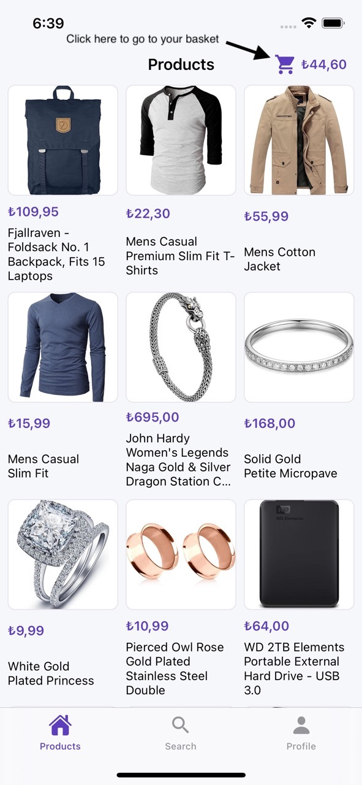
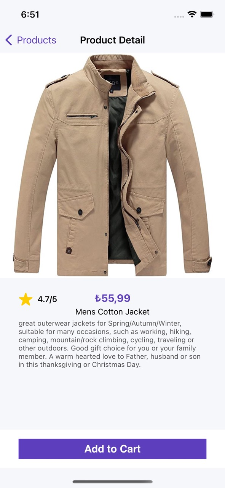

# Pazarama iOS Bootcamp - Bitirme Projesi

## Shopping App

  Sahte bir mağazadan ürünleri sepetinize ekleyip alışveriş yapmanızı sağlayan bir uygulama.

### Kullanılan Kütüphaneler 
#### Minimum iOS Sürümü: 12.0

- FirebaseAuth: https://firebase.google.com
- FirebaseFireStore: https://firebase.google.com
- IQKeyboardManager: https://github.com/hackiftekhar/IQKeyboardManager
- Toast: https://github.com/scalessec/Toast-Swift
- KingFisher: https://github.com/onevcat/Kingfisher
- Moya: https://github.com/Moya/Moya

### Kurulum

Repo linkini kopyalarak çekebilirsiniz. Package kurulumları küçük bir ihtimalle problem çıkartaiblir. Projeyi çalıştıramazsanız şu adımları uygulamayı deneyin:

1. Xcode -> File->Packages-> Reset Package Caches
2. Xcode -> File->Packages-> Resolve Package Versions
3. Xcode -> File->Packages-> Update to latest Package Versions

### Ekran Görüntüleri
     
